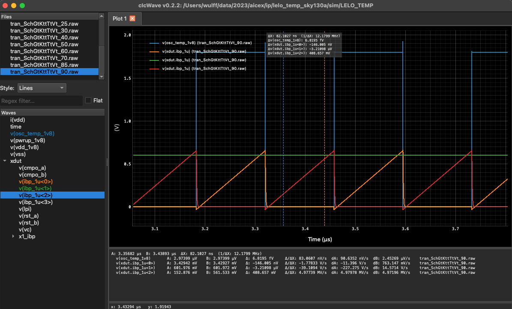

# Custom IC Creator Simulation Tools

[](https://github.com/wulffern/cicsim/actions/workflows/main.yml)


# Why
This is a script package I use to control ngspice, it can

- Run corner simulations
- Create IPs (used in  [wulffern/aicex](https://github.com/wulffern/aicex) )
- Create simulation directories
- View waveforms

# Changelog

| Version | Status             | Comment                        |
|:--------|:-------------------|:-------------------------------|
| 0.0.1   | :white_check_mark: | First version of cicsim        |
| 0.0.3   | :white_check_mark: | All in on open source tools    |
| 0.1.2   | :white_check_mark: | First version on pipy          |
| 0.1.3   | :white_check_mark: | github action update           |
| 0.1.4   | :white_check_mark: | Added waveform viewer          |
| 0.1.5   | :white_check_mark: | Update waveform viewer         |
| 0.1.6   | :white_check_mark: | wave: added search. Added docs |


# Install this module
If you want to follow the latest and greatest
``` sh
git clone https://github.com/wulffern/cicsim
cd cicsim
python3 -m pip install --user -e . 
```

If you want the latest stable

``` bash
python3 -m pip install cicsim
```

# Get started with simulation
Head over to [Open source analog integrated circuit flow on Skywater
130nm](https://analogicus.com/rply_ex0_sky130nm/tutorial) to see cicsim in action.

# Get started with waveform viewer

Make sure you install a python version with tk. On my mac it was

``` bash
brew install python-tk
```

Once installed, I do

``` bash
cicsim wave output_tran/tran_SchGtTtKffVh_*
```




# Commands

``` 
Usage: cicsim [OPTIONS] COMMAND [ARGS]...

  Custom IC Creator Simulator Tools

  This package provides helper scripts for simulating integrated circuits

Options:
  --help  Show this message and exit.

Commands:
  plot         Plot from rawfile
  portreplace  Replace ${PORTS} and ${VPORTS} with the subcircuit ports...
  results      Results of single runfile
  run          Run a ngspice simulation of TESTBENCH
  simcell      Create a ngspice simulation directory for a Cell
  srun         Run a spectre simulation of TESTBENCH
  summary      Generate simulation summary for results
  wave         Open waveform viewer
```
