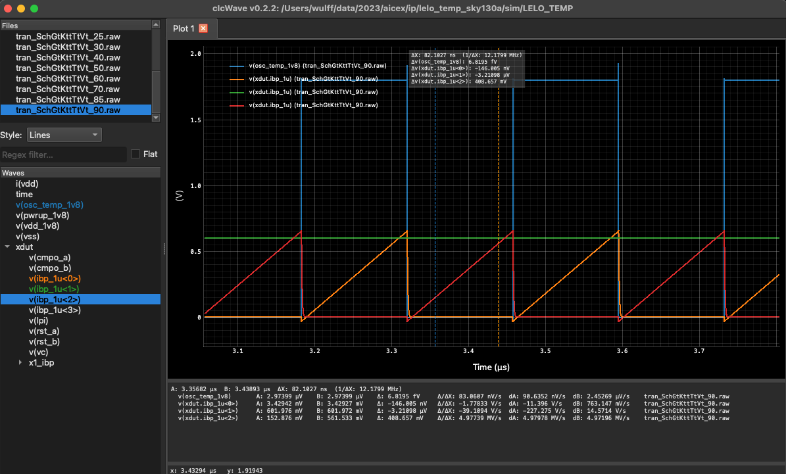

# Custom IC Creator Simulation Tools

[](https://github.com/wulffern/cicsim/actions/workflows/main.yml)


# Why
This is a script package I use to control ngspice, it can

- Run corner simulations
- Create IPs (used in  [wulffern/aicex](https://github.com/wulffern/aicex) )
- Create simulation directories
- View waveforms

# Changelog

| Version | Comment                                         |
|:--------|:------------------------------------------------|
| 0.0.1   | First version of cicsim                         |
| 0.0.3   | All in on open source tools                     |
| 0.1.2   | First version on pipy                           |
| 0.1.3   | github action update                            |
| 0.1.4   | Added waveform viewer                           |
| 0.1.5   | Update waveform viewer                          |
| 0.1.6   | wave: added search. Added docs                  |
| 0.1.7   | Bugfix: ngraw deprecated float_                 |
| 0.1.8   | Added template command                          |
| 0.1.9   | Bugfix: allow absolute path in template command |
| 0.1.11  | Added directory name option (dname) to template |
| 0.1.12  | Added sndrfs and enobfs to fftWithHanning       |
| 0.1.13  | Added docs                                      |
| 0.1.14  | Nothing exiting                                 |
| 0.1.15  | Added "archive" command to save old simulations. Added "--no-color" option |
| 0.1.16  | Fixed ngspice-45 compatibility. Fixed regex escapes. Fixed seed value handling |
| 0.1.17  | Updated docs and spec |
| 0.1.18  | Code quality overhaul: replaced os.system with subprocess, replaced eval with ast.literal_eval, migrated to Python logging module, added documentation for all CLI commands, removed setup.py in favor of pyproject.toml |
| 0.1.19  | Wave viewer overhaul: measurement cursors (A/B) with delta readout, scroll-wheel zoom, keyboard shortcuts, engineering notation on axes (EngFormatter), Export PDF, legend toggle, regex search tooltip, Help menu. Fixed pyproject.toml license for Python 3.8. Added unit tests |
| 0.2.0   | New pyqtgraph backend (`--backend pg`): hierarchical wave browser, automatic dual Y-axes, GPU-accelerated rendering, closeable tabs, analysis functions (FFT/PSD, Histogram, Differentiate, X vs Y). Fixed AC analysis complex data plotting |
| 0.2.1   | Multi-format file support: CSV, TSV, Excel, JSON, Parquet, Feather, HDF5, Pickle, and more. `--sheet` option for Excel files. String/categorical axis support with rotated labels. Gradient (dy/dx) and slope in cursor readout. Double-click to plot. Regex signal picker for X vs Y |
| 0.2.2   | cicwave: fixed file selection, added zoom/line-width/font-size controls, statistics readout, session save/load, pivot support, dark theme, plot style selector, matplotlib export |
| 0.2.3   | cicwave: light/dark theme toggle, session and pivot documentation |
| 0.2.4   | cicwave: toggle wave visibility on double-click in browser |
| 0.2.5   | cicwave: fixed grid in light mode, improved zoom performance, fixed font warning |
| 0.2.6   | cicwave: drag-and-drop files, file menu, improved A/B cursor readout and X vs Y picker. Added GitHub release workflow |
| 0.2.7   | `cicsim run`: added `--threads` for parallel simulations, `--progress` for tqdm progress bar, `--timeout` to kill hung sims, rich terminal results table. Bug fixes: uninitialized error state, float parse errors in log, silent measurement failures, dead code removed. CI: dependabot, ruff lint on PRs, pinned action versions, automated PyPI publish |


# Install this module
If you want to follow the latest and greatest
``` sh
git clone https://github.com/wulffern/cicsim
cd cicsim
python3 -m pip install --user -e . 
```

If you want the latest stable

``` bash
python3 -m pip install cicsim
```

# Get started with simulation
Head over to [Sky130nm tutorial](https://analogicus.com/aic2026/sky130nm_tutorial) to see cicsim in action.

# Get started with waveform viewer

A standalone `cicwave` command is available that defaults to the pyqtgraph
backend. It is equivalent to `cicsim wave --backend pg`.

``` bash
# Standalone command (defaults to pg backend)
cicwave output_tran/tran_SchGtTtKffVh_*

# Or via cicsim subcommand
cicsim wave output_tran/tran_SchGtTtKffVh_*              # tkinter backend
cicsim wave --backend pg output_tran/tran_SchGtTtKffVh_*  # pyqtgraph backend
```

Supported file formats: `.raw` (ngspice), `.csv`, `.tsv`, `.txt`, `.xlsx`,
`.xls`, `.ods`, `.json`, `.parquet`, `.feather`, `.h5`, `.hdf5`, `.pkl`,
`.pickle`, `.html`, `.xml`, `.fwf`, `.dta`, `.sas7bdat`, `.sav`.

``` bash
# Open CSV / Excel files
cicwave data.csv
cicwave data.xlsx --sheet "Sheet2"
```



## Wave viewer keyboard shortcuts

| Key | Action |
|:-------------|:-------------------------------|
| `A` | Set cursor A at mouse position |
| `B` | Set cursor B at mouse position |
| `Escape` | Clear cursors |
| `F` | Auto scale (fit) |
| `R` | Reload all waves |
| `L` | Toggle legend |
| `Ctrl+O` | Open file |
| `Ctrl+P` | Export PDF |
| `Ctrl+N` | New plot tab (pg) |
| `Ctrl+W` | Close current tab (pg) |
| `Ctrl+Q` | Quit |
| Scroll | Zoom x-axis |
| Shift+Scroll | Zoom y-axis |

## Analysis functions (pg backend, right-click menu)

| Function | Description |
|:---------|:-----------|
| FFT / PSD | Power spectral density in dB with Hanning window |
| Histogram | Distribution with Gaussian fit, mean and sigma |
| Differentiate | Numerical dy/dx |
| X vs Y | Parametric plot with regex signal picker |


# Commands

```
Usage: cicsim [OPTIONS] COMMAND [ARGS]...

  Custom Integrated Circuit Simulation

  This package provides helper scripts for simulating integrated circuits

  Check website for more information : http://analogicus.com/cicsim/

Options:
  --color / --no-color  Enable/Disable color output
  --help                Show this message and exit.

Commands:
  archive      Save a cicsim run output
  plot         Plot from rawfile
  portreplace  Replace ${PORTS} and ${VPORTS} with the subcircuit ports...
  results      Results of single runfile
  run          Run a ngspice simulation of TESTBENCH
  simcell      Create a ngspice simulation directory for a Cell
  srun         Run a spectre simulation of TESTBENCH
  summary      Generate simulation summary for results
  template     Run an IP template with <options> YAML file
  wave         Open waveform viewer

Key options for run:
  --threads N            Run N simulations in parallel
  --progress             Show tqdm progress bar instead of interleaved logs
  --timeout N            Kill any simulation that runs longer than N seconds
  --sha / --no-sha       Skip re-running simulations whose input files haven't changed
  --count N              Run each corner N times (Monte Carlo)
```

A standalone command is also available:

```
Usage: cicwave [OPTIONS] [FILES]...

  Waveform viewer (standalone). Defaults to the pyqtgraph backend.

Options:
  --x TEXT                Specify x-axis
  --backend [tk|pg]       GUI backend (default: pg)
  --sheet TEXT            Sheet name for Excel files
  --help                  Show this message and exit.
```
